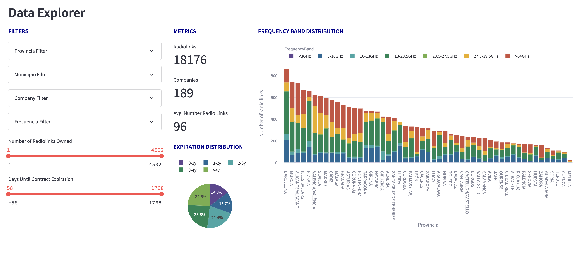
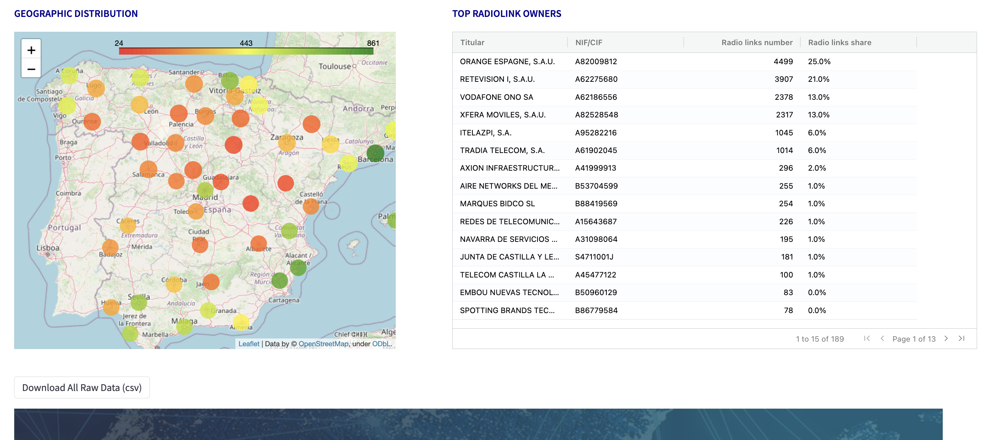
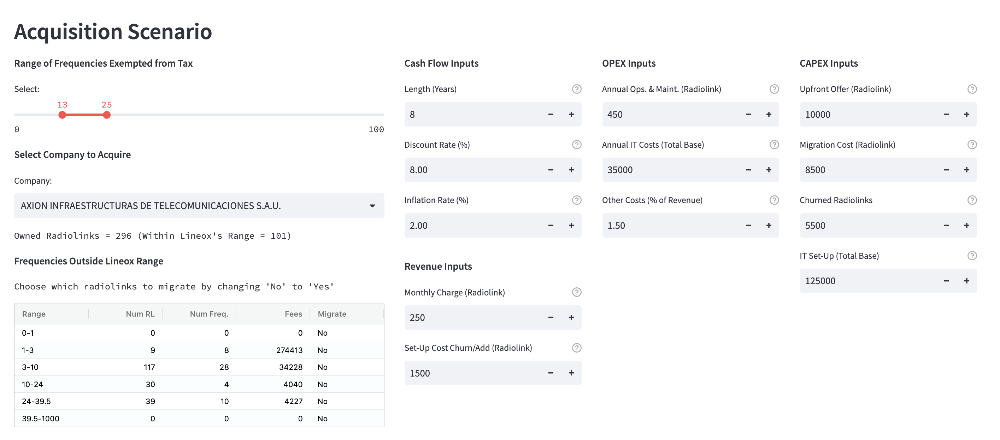
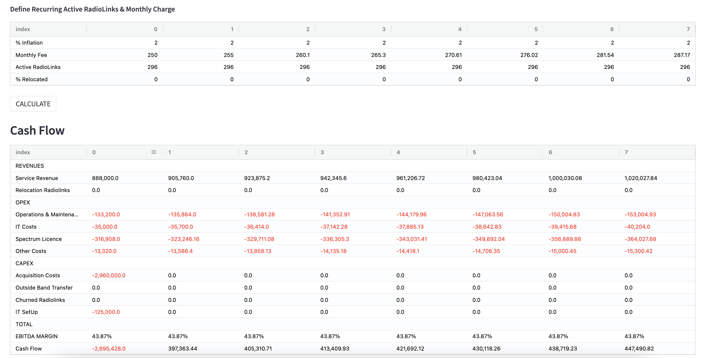

# Lineox Capstone Project - Documentation

## Abstract

This project is a **web scraping and data analysis tool** designed to collect information about radiolinks across different provinces in Spain. Specifically, the tool scrapes data from the search engine provided at https://sedeaplicaciones.minetur.gob.es/RPC_Consulta/FrmConsulta.aspx and saves the information collected in a structured CSV file called 'data.csv'.

The aim of this project is to help Lineox collect data of the Radiolinks market in Spain to use for their **company acquision strategy**, using a user-friendly dashboard that provides valuable insights and analysis.

To achieve **the web scrapping + standarization of the data**, the project includes two main components: `scrapper.py` and `dataprep.py`. The `scrapper.py` is responsible for webscraping the data and saving it to 'rl_data.csv', while `dataprep.py` performs data standarization and cleaning to convert 'rl_data.csv' into a structured table format in 'data.csv'.

Finally, the project includes a **dashboard**, which is divided in two sections:
1. **Explorer**: Allows the user to explore the dataset of radiolinks in Spain using several visualization charts and a set of filters.




2. **Radiolink Acquisition Scenario**: The user may input a series of parameters in order to simulate the financials (Cash Flow) of an acquisition scenario of the radiolinks of a company.





## 1. General Requirements and Dependencies

- **Pandas:** `pip install pandas`
- **Playwright:** `pip install playwright`
- **Requests:** `pip install requests`
- **Math:** included in Python's standard library, no need for installation
- **Numpy:** `pip install numpy`
- **Datetime:** included in Python's standard library, no need for installation
- **Pandas Cut:** included in Pandas library, no need for installation
- **Numpy Financial:** `pip install numpy_financial`
- **Plotly:** `pip install plotly`
- **Folium:** `pip install folium`

## 2. How to Run the Project

### 2.1 Automated Install (Friendly User)

1. Save the Lineoxapp folder in your Desktop 
2. Double click on the python 3.11 installer, close the python popup folder
3. Double click on the OS/Windows Installer

        3.1 If a text editor opens instead of the terminal, you need to change the app that opens the file to the Terminal.
        
        3.1.1 Right-click on the OS Installer and select "Get Info". Look for "Terminal" in "Open with".

        3.1.2 If you cannot see the Terminal or cannot select it, click "Other", enable "All applications", select the Terminal, click "OK", and then select "Change All". This will ensure that all similar files open with the "Terminal".

        3.2 Do the same with the rest of apps if they open the text editor

4. Double click on the app you want to use

### 2.2 Manual Install (If Automated Install doesn´t work)

#### Project setup

1.	Download CapstoneProjectLineox
2.	Create a folder called ‘Lineoxapp’ in your **Dekstop**
3.	Save ‘CapstoneProjectLineox’ inside the folder called ‘Lineoxapp’

#### Installing Python 3.11.0 or above

1.	Download python 3.11.0 or above url: [python.org/downloads](https://www.python.org/downloads/)
2.	Install python, click continue till it gets installed
3.	Close the pop up folder of python 3.11

#### Virtual environment setup for Mac and Windows

1.	Create a virtual environment called ‘lenv’ inside the Lineoxapp folder and activate the environment (Do the following)

    Open a terminal, copy paste the following commands and press enter: 

    1.1 `cd Desktop/Lineoxapp`  
   
    1.2 `python3.11 -m venv lenv`
   
    1.3  Mac Users: `source lenv/bin/activate`   
    
    1.4  Windows Users: `lenv\Scripts\activate.bat` 

**Note:** Make sure that you only have one virtual environment activated.
If the beginning of your command line appears like this:

“ *(lenv) (base) alvaro@Macbook-Pro-M1* “

It means that you have two environments active (lenv) and (base). 

You should only have one environment activated. Run the following command.

`Conda deactivate`

#### Install the requirements of the project

1. In the same terminal, copy paste the following commands and press enter: (*If for whatever reason you closed the terminal, copy paste the next code first* `cd Desktop/Lineoxapp`)

    1.1 `pip install --upgrade pip`
    
    1.2 `cd capstoneProjectLineox`
    
    1.3 `pip install -r requirements.txt`

2. Close the terminal

#### Run the Project

1. Open the terminal and copy paste the next commands:

    1.1 `cd Desktop/Lineoxapp`
    
    1.2 `source lenv/bin/activate`
    
    1.3 `cd CapstoneProjectLineox`
    
    1.4 `streamlit run Home.py`

#### Webscrapper

1. Open the terminal and copy paste the next commands:

    1.1 `cd Desktop/Lineoxapp`
    
    1.2 `source lenv/bin/activate`
    
    1.3 `cd CapstoneProjectLineox`
    
    1.4 `python scrapper.py`

    1.5 `python dataPrep.py`

## 3. Code Documentation

### 3.1 Webscrapper Documentation

- #### **WebScrapper:** `scrapper.py`

The web scraper component of the project is a Python script named **"scrapper.py"**. The script uses the Playwright library to navigate to a specific web page (https://sedeaplicaciones.minetur.gob.es/RPC_Consulta/FrmConsulta.aspx), select a specific option, and search for information about the radio links in different provinces of Spain. The script collects the data from the web page by extracting the text from each row of the table on the web page. It then stores the data in two separate lists - one for the main table and another for the frequency sub-table. The main list contains information about the owners of the radio links, and the frequency sub-table list contains information about the frequencies used by the radio links.

The script uses several libraries to scrape and manage the data. These include the Pandas library for working with dataframes, the Playwright library for web scraping, the math library for mathematical operations, and the time library for controlling the script's timing.

**The script scrapes data for all the provinces in Spain and creates two dataframes** - one for the main table and one for the frequency sub-table. It then **merges these dataframes on the reference column to create a final dataframe** with information about the owners and frequencies of radio links in each province. The final dataframe is then saved as a CSV file named **"rl_data.csv".**

To run the scraper, one needs to have the required libraries installed and configured correctly. They can then run the script in a Python environment. *The scraper is designed to work specifically with the aforementioned web page and is not designed to work with other websites.*


- #### **Data Preparation Script:** `dataPrep.py`

This script performs several operations on the "rl_data.csv" to **clean and homogenize** the data:

1. Fill the NaN values in "Provincia_FREQ" and "Municipio" columns with the previous value.
2. Convert "Frecuencia" values from strings to floats.
3. Convert "Frecuencia" values from MHz to GHz.
4. Convert "FConcesion" and "FCaducidad" to datetime format.
5. Homogenize features by replacing values with the most frequent ones for each NIF/CIF ID.
6. Assignt a "Frequency Band" to each row based on a set of defined bins.

The resulting dataframe is stored in a new file named **data.csv**. This is the data used for the dashboard tools.

### 3.2 Dashboard Documentation

- #### **Class dataLineox and Auxiliary Functions:** `dataExplorer.py`

The script defines the class **dataLineox**, which is instanced whenever the dashboard is started, and contains methods to filter and analyze the data.

````python
class dataLineox:

    def __init__(self): --> initiation
    # 1. Loads the data from "data.csv".
    # 2. Replaces missing values for FCaducidad with the current date and calculates the number of days until the expiration date for each radiolink.
    # 3. Calculates the maximum and minimum number of radiolinks owned by a company, the maximum and minimum frequency of the radiolinks, and the list of frequency bins.
    # 4. Calculates the maximum and minimum expiration date of the radiolinks, the list of companies that own radiolinks, the list of provinces, and the list of municipalities.

    ### Methods for Explorer Section:

    def filterDf(self, freq_op, ldays, hdays, prov_op, mun_op, owner_op, lnumRadio, hnumRadio): --> dfFiltered
    # Takes as input different all posible filter criteria and returns a filtered data frame containing only the radiolinks that meet the criteria.
        
    def calculateKPI(self, freq_op, ldays, hdays, prov_op, mun_op, owner_op, lnumRadio, hnumRadio): --> rlnbr,compnbr,rlperowner
    # Returns the number of radiolinks, number of companies, and average number of radiolinks per company that meet the criteria.

    def topOwners(self, freq_op, ldays, hdays, prov_op, mun_op, owner_op, lnumRadio, hnumRadio): --> df
    # Returns a data frame containing radiolink owners that meet the criteria, along with the total number of owned radiolinks, and their representing market share.

    def createBarplot(self, freq_op, ldays, hdays, prov_op, mun_op, owner_op, lnumRadio, hnumRadio): --> barplot
    # Creates and returns a stacked bar plot showing the number of radiolinks distribution (defined frequency bins) for each province.

    def createPieChart(self, freq_op, ldays, hdays, prov_op, mun_op, owner_op, lnumRadio, hnumRadio): --> plot
    # Creates and returns a piechart showing the number of radiolinks distribution for each period of expiration days defined.
    
    def createMap(self, freq_op, ldays, hdays, prov_op, mun_op, owner_op, lnumRadio, hnumRadio): --> spain_map
    # Creates and returns a map showing the number of radiolinks in each province.

    ### Methods for Acquisition Section:

    def numRadioLinks(self, owner_op, freqExemptedRange): --> radiolinksOwned, radiolinksOwnedLineoxFreq
    # Returns the total number of radiolinks owned by the selected company, and the number of those radiolinks that fall in Lineox's frequency range (defined by the user).

    def tableFees(self, owner_op, freqExemptedRange): --> dfNotOwned
    # Returns a table showing the number of radiolinks in different frequency bins that the owner does not own, along with the tax fees that would need to be paid to operate on those frequencies.
````

The script also includes two other **auxiliary functions** for the Acquisition Scenario Section:

1. `generateCashFlow`: Takes all the inputs from the acquisiton scenario and generates the cashflow table; with sections REVENUE, OPEX, CAPEX, TOTAL.
2. `calculateFinancials`: Takes as input the cash flow statement and a discount rate, and calculates the net present value (NPV) and internal rate of return (IRR) for the defined investment scenario.

The script is imported in the "frontend" scripts `Explorer.py` and `Acquisition Scenario.py`. 

- #### **Data Input for Tax Calculation:** `dataEntries.py` 

In this script the parameters used in the Tax Calculation Formula by the Spanish Government can be defined and it is flexible, meaning it can be changed for future updates.
Parameters C, S, and B are defined in the form of a dictionary, where each key is the frequency band to which they apply. Example:

```python
# For frequencies between 0-1 GHz, define C1,C2,..,C5, S, and B
formulaParameters = {
    '0-1'        : {
        'C':[1.3, 1, 1.3, 1.25, 0.4],
        'S':20,
        'B':28000
    },
    ...
}
```

- #### **Acquisition Scenario Input Parameters:** `definitions.py` 

In this script the preditermined inputs used in the Acquisition Scenario are defined. Moreover, the "tooltip" containing the definition of the input can be defined.
In the form of a dictionay, where each key is the input name assigned to the streamlit's component. Example:

```python
# For the input "periods", definition + preditermined value.
definitions = {
    'periods' : {
        'def' : '''
        Number of periods for investment scenario.
        ''',
        'value' : 8
    },
    ...
}
```

- #### **Explorer Section:** `Explorer.py`

This script defines the frontend of the dashboard's page "Data Explorer" allowing users to **explore the radiolinks data based on a set of filters, view different metrics, and visualize the distribution of the data on a map and bar chart.**

The code **imports class dataLineox from the dataExplorer.py** and uses the Streamlit library to define the different components in the page. 

- #### **Acquisition Scenario:** `Acquisition Scenario.py`

This script defines the frontend of the dashboard's page "Acquisition Scenario" allowing users to **input financial data and revenue assumptions for a hypothetical company acquisition scenario.**

The dashboard is created using the Streamlit library and the dataExplorer, generateCashFlow, and calculateFinancials functions imported from dataExplorer.py. The AgGrid library is also used for displaying data in a customizable grid format.

All flexible inputs are displayed at the top of the page. The CALCULATE button is used to generate a cash flow statement based on the user's inputs. The resulting cash flow statement is displayed together with the net present value (NPV) and internal rate of return (IRR) of the investment.

- #### **Home Page:** `Home.py`

When using Streamlit to build a web application, it is common to have multiple pages, each with its own functionality and content. The different sections of the dashboard are stored in the folder named "pages", while the **"main" file that launches the Streamlit application is the "Home.py".**


